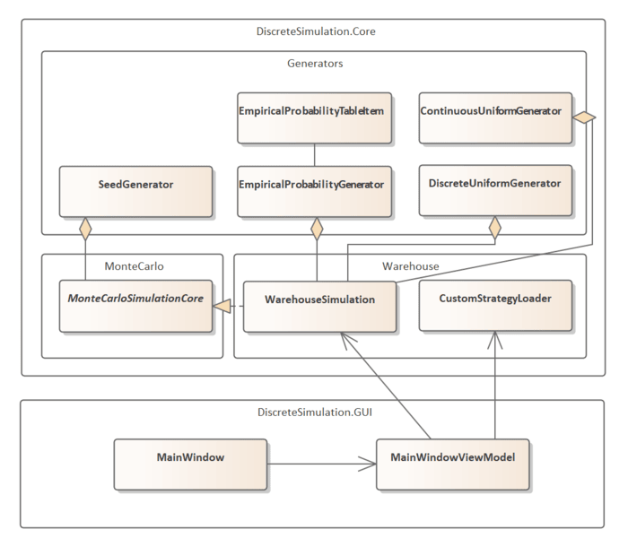
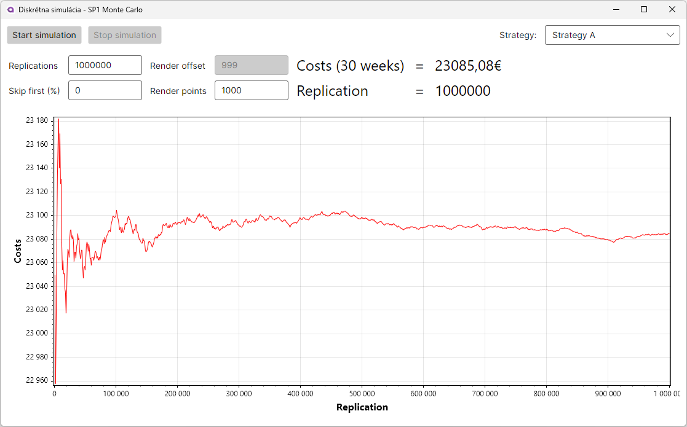
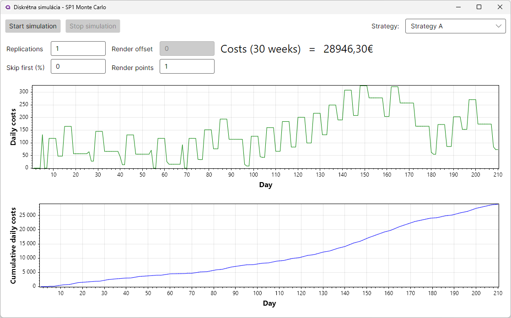

# 📦 Warehouse Simulation using Monte Carlo Method
This project is a simulation of a warehouse supply system using the Monte Carlo method. It models the storage and delivery of car parts, taking into account various strategies and custom strategies for ordering from suppliers and the associated costs. The simulation is built using .NET and Avalonia for the user interface.

The application was developed as the first semester work on the Discrete Simulation course at the Faculty of Management Science and Informatics of the University of Žilina.

## 📊 Features
- 🕹️ Two modes of simulation: 
  - **Single replication**: Daily cost evolution and cumulative costs visualized in detailed charts
  - **Multiple replications**: Shows cost convergence trends across simulation replications
- 🔄 Customizable simulation settings:
  - Adjustable replication count
  - Chart display configuration
- 🎯 Strategies for ordering parts:
  - Predefined strategies (A-D)
  - Custom strategy implementation
- 📄 Text file import for custom strategies

## 🚀 Video Preview
https://github.com/user-attachments/assets/e40bf3f3-5874-4785-b7c9-17900d135df6

## 💡 Simulation Scenario
The simulation models a warehouse operated by a businessman, who stores and delivers car parts for nearby auto repair shops and a car manufacturer. The warehouse deals with three types of parts: shock absorbers, brake pads, and headlights, which are supplied by two suppliers. 

Bought parts are delivered every Monday morning, and the warehouse incurs daily storage costs for each type of part. Every Friday morning, a customer requests a random number of parts, which varies each week and is modeled using custom probability distributions. For each undelivered part, the businessman incurs a penalty. Furthermore, the reliability of suppliers is not 100%, and the delivery probabilities are modeled using custom distributions.

Businessman wants to minimize costs over 30 weeks of warehouse operation related to part storage, including penalties for undelivered parts, and decides between several ordering strategies.

### 🎯 Assignment strategies
- **Strategy A**: Order every week from Supplier 1
- **Strategy B**: Order every week from Supplier 2
- **Strategy C**: Order from Supplier 1 on odd weeks and Supplier 2 on even weeks
- **Strategy D**: Order from Supplier 2 on odd weeks and Supplier 1 on even weeks

### 🤔 Custom Strategies
- **Custom Strategy 1**: Orders based on analyzed expected values of parts requested by the customer, reducing unnecessary orders usign random variable *X* with probability distributions and their mean values *E(X)*.
- **Custom Strategy 2**: Similar to Custom Strategy 1, but reduces the expected values by 10% to further minimize costs.
- **Custom Strategy 3**: Orders no parts at all, only pays penalties for undelivered parts, resulting in the lowest costs.

## 🛠️ Program Architecture

    
    

        <em>Simplyfied class diagram of the program architecture</em>
    

## 📚 Documentation
[📘 Detailed semester work documentation](docs/documentation.pdf) includes details about:
- Simulation core implementation
- Custom probability distributions
- Strategy analysis
- Experimental results

 

<em>Multiple replications simulation showing cost convergence over replications</em>

<em>Single replication simulation showing costs over days</em>

 
 
 

# 📦 Simulácia skladu pomocou metódy Monte Carlo
Tento projekt je simuláciou systému zásobovania skladu pomocou metódy Monte Carlo. Modeluje skladovanie a dodávku automobilových súčiastok, pričom zohľadňuje rôzne zadané stratégie a vlastné stratégie objednávania od dodávateľov a s tým spojené náklady. Simulácia je postavená na platforme .NET a Avalonia pre používateľské rozhranie.

Aplikácia bola vytvorená ako prvá semestrálna práca v rámci predmetu Diskrétna simulácia na Fakulte riadenia a informatiky Žilinskej univerzity v Žiline.

## 📊 Funkcie
- 🕹️ Dva režimy simulácie: 
  - **Jedna replikácia**: Denný vývoj nákladov a kumulatívne náklady vizualizované v podrobných grafoch
  - **Viacnásobné replikácie**: Ukazuje trend ustálenia nákladov cez opakované simulácie
- 🔄 Prispôsobiteľné nastavenia simulácie:
  - Nastaviteľný počet replikácií
  - Konfigurácia zobrazenia grafov
- 🎯 Stratégie objednávania súčiastok:
  - Preddefinované stratégie (A-D)
  - Implementácia vlastných stratégií
- 📄 Načítanie vlastných stratégií z textového súboru

## 🚀 Video Ukážka
https://github.com/user-attachments/assets/e40bf3f3-5874-4785-b7c9-17900d135df6

## 💡 Scenár simulácie
Simulácia modeluje sklad prevádzkovaný podnikateľom, ktorý skladuje a dodáva automobilové súčiastky pre blízke autoservisy a automobilku. Sklad sa zaoberá tromi typmi súčiastok: tlmiče, brzdové doštičky a svetlomety, ktoré sú dodávané dvoma dodávateľmi.

Kúpené súčiastky sú dodávané každý pondelok ráno do skladu a sklad má denné náklady na skladovanie pre každý typ súčiastky. Každý piatok ráno zákazník požaduje náhodný počet súčiastok, ktorý sa líši každý týždeň a je modelovaný pomocou vlastných rozdelení pravdepodobnosti. Za každú nedodanú súčiastku podnikateľ platí pokutu. Spoľahlivosť dodávateľov nie je 100% a pravdepodobnosti dodania sú modelované pomocou vlastných rozdelení.

Podnikateľ chce minimalizovať náklady počas 30 týždňov prevádzky skladu súvisiace so skladovaním súčiastok, vrátane pokút za nedodanie, a rozhoduje sa medzi niekoľkými stratégiami objednávania.

### 🎯 Zadanie stratégií
- **Stratégia A**: Objednávanie každý týždeň od dodávateľa 1
- **Stratégia B**: Objednávanie každý týždeň od dodávateľa 2
- **Stratégia C**: Objednávanie od dodávateľa 1 v nepárnych týždňoch a od dodávateľa 2 v párnych týždňoch
- **Stratégia D**: Objednávanie od dodávateľa 2 v nepárnych týždňoch a od dodávateľa 1 v párnych týždňoch

### 🤔 Vlastné stratégie
- **Vlastná stratégia 1**: Objednávanie na základe analyzovaných očakávaných hodnôt požadovaných súčiastok, zníženie zbytočných objednávok pomocou náhodnej premennej *X* s rozdeleniami pravdepodobnosti a ich strednými hodnotami *E(X)*.
- **Vlastná stratégia 2**: Podobná ako Vlastná stratégia 1, ale zníženie očakávaných hodnôt o 10% na ďalšie zníženie nákladov.
- **Vlastná stratégia 3**: Neobjednanie žiadnych súčiastok, iba platba pokút za nedodanie, čo vedie k najnižším nákladom.

## 🛠️ Architektúra programu

    
    

        <em>Zjednodušený diagram tried architektúry programu</em>
    

## 📚 Dokumentácia
[📘 Podrobná dokumentácia semestrálnej práce](docs/documentation.pdf) obsahuje detaily o:
- Implementácii jadra simulácie
- Vlastných rozdeleniach pravdepodobnosti
- Analýze stratégií
- Výsledkoch experimentov

 

<em>Simulácia viacnásobných replikácií zobrazujúca konvergenciu nákladov počas replikácií</em>

<em>Simulácia jednej replikácie zobrazujúca náklady počas dní</em>

